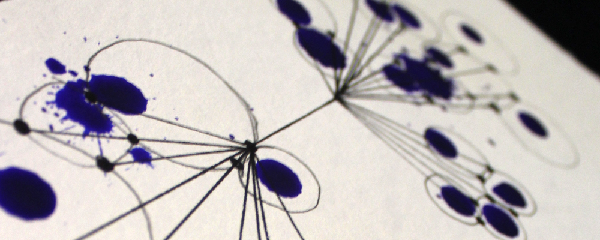
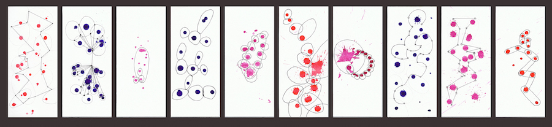
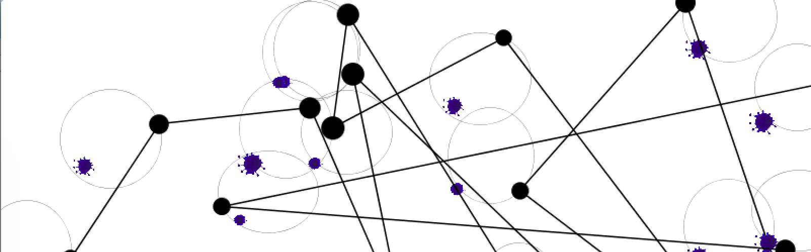

# Orderly chaos

#1. Conceptual formulation

The first exercise in the course **"Eingabe-Ausgabe"** was to device an analgogue algorithm.
It need to be as precise and clear as possible for the people who put it into execution.

### Instructions of first version
( 5 minutes speed exercise)

+ Draw 10 or more circles on a squarish drawing surface
+ A circle have to touch or carve minimum one other circle
+ If there are generated more then 5 intersections hatch them blue
+ If there are generated less then 5 intersections hatch them red

Theese are the results of the very beginning:

  
   
  
  These thing weren`t clear enough and could be understould in different ways:
  
  + Draw 10 or more circles on a squarish drawing surface
  + A => **Every circle** have to touch or carve minimum one other circle
  + If there are generated **overall** more then 5 intersections hatch them => **the intersections** blue
  + If there are generated **overall** less then 5 intersections hatch them => **the intersections** red
  
After the course discused the results of erveryone our task was to improve the algorithm and give it to 10 persons to put it into execution
  
### Instructions of the second version

Materials: white paper, green red and blue colored felt pen, mix of differnt pens, ball pens and so on

+ Draw minimum 20 circles in different sizes on the sheet
+ Every circle have to touch or carve minimum one other circle
+ If there are generated more then 10 intersections hatch the intesections blue
+ If there are generated less then 10 intersections hatch the intesections red
+ Mark every point of intersection and osculation point with the green marker
+ Connect every green point with each other.

These are the results of the second version executed by ten differnt people:

  
  
  

### Instructions of the final version

**Materials: 3 different water-color mix, pen, Setsquare, black felt pen, injection**

0. Write any number on the back of your paper

1. Take the injection and spread the color with eyes closed drop per drop over the frontside of the paper.
 (Min. 10 drops)

2. Let the dabs getting dry

3. Draw an ellipse arround every dab whose range isn`t bigger the the range of the pen
 Smaller dabs can be inside of an ellipse as well.Every ellipse need to carve minimum one other ellipse. Ellipses can get over the end of the paper.

4. Mark every point of intersection with the black felt pen


5. If you had written an even number on the back of your paper follow step **6a**
  Otherwise follow step **6b**

  6a Link all marked points of intersection with the black felt pen


  6b Retrace every line which you have made befor with your pen with the black felt pen.
  
                
              
        
        
  
  
  
  
  

# Evaluation

I was realy satisfied with the results i receved. The algorithm was explicated mostly right and looked like the images i had in mind.
I could manage that the images do not all look the same but it is still clear that all the people who put the alorithm into execution had the same task.

# Resume

I think it was a very good exercise to practise express myself.
It was neccesary to think about every single word. *Is this information realy needed or can i remove this?
Can this sentence be more short and precise? Would i undestand this if i would read the instruction the first time?*
Keep things simple but not boring is one sentence wich describes this exercise the best in my eyes.

# 2. Conceptual formulation 

The next steps was it to create a digital version of our analogue algorithm. 
We were not forced to do it exactly the same but it should have something to do with our first projekt.
My aim was it work close to my first exercise to see if i can manage it to tell the programm "processing" 
exactly what i want to have and not to work with any random results.

# Development of the projekt

For me it was neccesairy to keep the optical look of paint dabs. 
So i deceided to use png-Images of them and make them appear randomly on the white sheet. It was quite a long time for the next step: Put ellipses around every dab in different sizes and forms. But finally it worked.
The last thing i need to do was to mark the intersection points of two or more ellipses with a black dot. At this point i didn`t come forward so i decided to break this idea a little bit down. So i said make exactly one dot at every ellipse and connect these points with black lines. 

#Installation

You need to download processing to put this code into execution
https://processing.org/download/

# Usage
You copy the folder **data** and **Finaldigital** to your desktop and open the file with processing.
I wrote the code in Python so it`s necessairy to choose python in the upper righthand corner and click the run button. 

#Resumee

I liked this exercise very much and i am quite confident with the results as well
especially because i had no expirience with coding befor at all. It was really useful to understand the language python and gain a small insight into the huge world of coding. I couldn`t achieve the image i had in mind completly but it comes close to it.

#For what can this code might be used?

For this you can have a look at my repository: **generative-Logo**

#Generative Logo 

After i had a second look at my results i had the idea to use this to generate Logos for a fictional company. For this i needed to reduce my code to bring more clearence in the generated image. Every employee gets his own logo wich can be used for example for business cards or other print products. In this way every employee can choose his individual logo by clicking the play button as long as he finds the right one.
Here are some of an endless amount of examples: 

#Installation
You need to download processing to put this code into execution https://processing.org/download/

# Usage
You copy the folder **data** and **GenerativesLogo.pyde** to your desktop and open the file with processing.
I wrote this code in Python so it`s necessairy to choose python in the upper righthand corner and click the run button.

 

